<h1 align="center">Hugo Acosta</h1>

      Estudiante de <strong>Ingeniería en Tecnología de la Información</strong> 
      Desarrollador Web & Móvil | Redes y Ciberseguridad (Red Team) 
      Mazatlán, Sinaloa, México

---

### Sobre mí

Soy estudiante de TI con pasión por el desarrollo y las redes.  
Me gusta crear soluciones prácticas con **HTML, CSS, C++, C#, Java y Android Studio**,  
y al mismo tiempo fortalecer mi base en **redes Cisco (CCNA)** para avanzar hacia el área de  
**Ciberseguridad ofensiva y Pentesting**.

> Mi objetivo: combinar desarrollo y seguridad para crear herramientas útiles en auditoría y automatización de redes.

---

### 🛠️ Tecnologías que manejo

| Área | Tecnologías |
|------|--------------|
|  Desarrollo Web | HTML, CSS, JavaScript (básico), Supabase |
|  Desarrollo Móvil | Android Studio (Kotlin / Java) |
|  Programación | C++, C, Java |
|  Redes | VLANs, DHCP, Routing, Subnetting |
|  Ciberseguridad | Pentesting, Red Team (en formación) |
|  Herramientas | Git, GitHub, Wireshark, Linux, Metasploit, Burp Suite, ffuf, gobuster, SecLists, DNSrecon, Sublist3r |

---

### Proyectos destacados

 **Files-to-PDF**  
Aplicación de escritorio Java Swing para convertir, unir, dividir y manipular archivos PDF con vista previa y modo oscuro.  
➡️ [Ver repositorio](https://github.com/Ugo25/Files-to-PDF)

**Dowloaader for youtube**  
Proyecto experimental que realiza descargas de videos y audio de youtubr  
➡️ [Ver repositorio](https://github.com/Ugo25/Ratatube)

🌐 **Sitio Web / Cenaduria Chayito**  
Sitio web con fondo animado en CSS y estructura HTML completa.  
➡️ [Ver repositorio](https://github.com/Ugo25/CenaduriaChayito.git)

**Lab-Redes-CCNA (en progreso)**  
Laboratorios de práctica en Packet Tracer con topologías, VLANs, DHCP y routing.  

---

### Contacta conmigo

  
  
  
  

---

### 📈 Actividad reciente

---

“Aprender, construir y compartir conocimiento cada día.”

